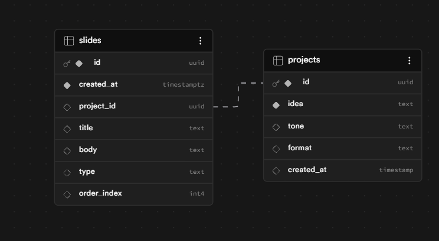

# 🚀 Carousel Studio — AI-Powered Social Media Content Engine

Turn messy ideas into **ready-to-post Instagram creatives** — with structured storytelling, AI + fallback reliability, and real product-level iteration.

🔗 Live Demo: [Launch Carousel Studio](https://carousel-studio-yojit.vercel.app/)

📦 GitHub: https://github.com/Yojitkataria/carousel-studio

---

## 🖼️ UI screenshot


## ✨ Problem

Creating high-quality social media content (especially for education brands like Cuemath) is:

- Time-consuming  
- Hard to structure (hook → insight → CTA)  
- Difficult to maintain consistency  
- Painful to iterate  

---

## 💡 Solution

Carousel Studio transforms:

> **“rough idea” → structured story → designed visual slides → export-ready content**

It combines:
- AI generation
- deterministic fallback logic
- real-time editing
- persistent history
- brand consistency

---

## 🧩 Key Features

### 🧠 1. Idea → Structured Story
- Converts natural language into **5-slide narrative**
- Enforces:
  - Hook (Slide 1)
  - Insights (Slides 2–4)
  - CTA (Slide 5)

---

### 🎨 2. AI + Visual Generation
- Uses Gemini for content generation
- Uses Pollinations for AI backgrounds
- Generates **thumb-stopping visuals automatically**

---

### 🔁 3. Smart Iteration Loop
- Edit text inline
- Regenerate individual slides
- Try hook variations
- Non-random improvement engine

---

### 🛡️ 4. Reliability (Core Differentiator)
- If AI fails → **Smart Local Fallback**
- Deterministic slide generation
- Ensures system never breaks

---

### 🗂️ 5. Content History (Supabase)
- Saves generated carousels
- Restore, reuse, and iterate
- Moves project from demo → real product

---

### 🎯 6. Template System
- Supports structured formats:
  - 5 Tips
  - Myth vs Fact
  - Before/After
- Templates guide AI output quality

---

### 📱 7. Multi-Format Support
- 1:1 Post
- 9:16 Story (short, punchy, emotional)
- Carousel (multi-slide storytelling)

---

### 🎨 8. Brand Consistency
- Custom colors, fonts, tone
- Saved via localStorage
- Ensures consistent output

---

### 📤 9. Export System
- Export single slide
- Export full carousel
- Instagram-ready resolution

---

## 🏗️ System Architecture


### Flow:

1. User inputs idea + tone + format
2. Frontend sends request → `/api/generate`
3. Backend:
   - builds structured prompt
   - calls Gemini API
4. If failure:
   - triggers fallback engine
5. Slides returned → rendered with AI visuals
6. Stored in Supabase (history)
7. User edits / regenerates / exports

---

## 🗄️ Data Layer (Supabase)

Carousel Studio persists user work to simulate a real content workflow:

- Projects table → stores idea, tone, format
- Slides table → stores structured slide data per project
- Enables history, restore, and iteration




## 🔄 Generation Flow


Key logic:

- Hook variation requests handled separately
- Regeneration uses context-aware prompts
- Story format enforces:
  - shorter text
  - emotional tone
  - faster pacing
- Fallback ensures:
  - no empty UI
  - deterministic output

---

## 🧠 Product Thinking

This project focuses on:

### 1. Not just generation — but usability
Most tools generate content.  
This system enables **iteration, editing, and reuse**.

---

### 2. Reliability over randomness
Fallback ensures:
- no broken experience
- consistent output even without AI

---

### 3. Real workflow simulation
- history
- templates
- brand system
→ mimics real content team tools

---

## ⚙️ Tech Stack

- **Frontend:** Next.js 14, React, Tailwind
- **Backend:** Next.js API routes
- **AI:** Google Gemini 2.0 Flash
- **Images:** Pollinations.ai
- **Database:** Supabase (Postgres)
- **Deployment:** Vercel

---


## 🔐 Environment Variables

Create a `.env.local` file in the root directory and add the following:

```env
GEMINI_API_KEY=your_key
NEXT_PUBLIC_SUPABASE_URL=your_url
NEXT_PUBLIC_SUPABASE_ANON_KEY=your_key
```

---

## 🚀 Run Locally

```bash
npm install
npm run dev
```

---

## 📈 Future Improvements

* Instagram direct publishing (Graph API)
* Team-based collaboration
* Advanced design templates
* AI-driven content scoring improvements

---

## [🎥 Demo](https://www.loom.com/share/c37042e59bc6493d9443af10f9c3623a)


---

## 🧑‍💻 Author

**Yojit Kataria**

* LinkedIn: https://www.linkedin.com/in/yojit-kataria/
* GitHub: https://github.com/Yojitkataria
